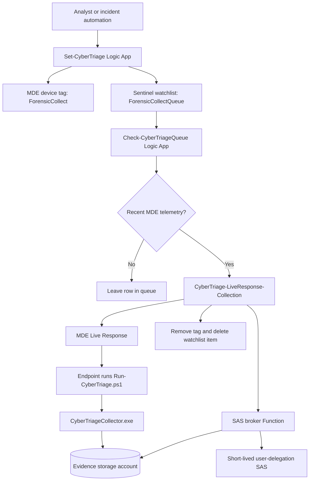

# CyberTriage Live Response Deployment

This repository packages a Microsoft Sentinel and Microsoft Defender for Endpoint workflow that launches Cyber Triage collection through MDE Live Response and uploads the encrypted result to Azure Blob Storage with a short-lived user-delegation SAS URL.

The goal is simple:

1. An analyst marks a device for collection.
2. The device is placed in a Sentinel watchlist queue.
3. A queue checker waits until the device is active in MDE.
4. A collection playbook generates a short-lived SAS URL.
5. MDE Live Response runs the Cyber Triage wrapper on the endpoint.
6. The endpoint uploads the encrypted artifact directly to Blob Storage.

No storage account key is passed to the endpoint. Shared key access should stay disabled.

## Current Status

This repo is a packaging and documentation starter. It contains validated commercial templates copied from the working lab deployment and draft GCCH copies that still need endpoint hardening before customer use.

Validated in lab on May 8, 2026:

- `Set-CyberTriage` added the MDE tag and queue row.
- `Check-CyberTriageQueue` selected only active/recent devices.
- `CyberTriage-LiveResponse-Collection` generated SAS successfully.
- MDE Live Response ran successfully on `<active-test-device>`.
- Tag removal and watchlist cleanup worked.
- Email notification failed but did not block collection.

Important lesson from the lab:

- A VM can be running in Azure and still be inactive in MDE.
- Inactive MDE devices cannot be collected because MDE Live Response cannot reliably run commands on them.

## Repository Map

```text
CyberTriage/
  README.md
  deploy/
    commercial/
      cybertriage-live-response-collection.json
      check-cybertriage-queue.json
      set-cybertriage.json
    gcch/
      *.gcch-draft.json
      README.md
  docs/
    architecture.md
    commercial-vs-gcch.md
    deployment-step-by-step.md
    operations-runbook.md
    permissions.md
    storage-and-sas-notes.md
  src/
    LiveResponse/
      Run-CyberTriage.ps1
    SasBrokerNode/
      Generate-CyberTriageSas/
      Health/
      host.json
      package.json
  assets/
    diagrams/
      architecture.mmd
      permissions.mmd
  packages/
    .gitkeep
```

## What You Need Before Deployment

You need these pieces before the flow can work:

1. A Microsoft Sentinel workspace.
2. Microsoft Defender for Endpoint with devices onboarded.
3. Permission to create Logic Apps, API connections, a Function App, Storage Accounts, and role assignments.
4. The Cyber Triage collector binary from the vendor.
5. The `Run-CyberTriage.ps1` wrapper uploaded to the MDE Live Response Library.
6. A storage account and container for encrypted Cyber Triage artifacts.
7. A SAS broker Function that can create user-delegation SAS URLs.
8. The three Logic Apps in this repo.

## High-Level Flow



## Deployment Order

Deploy in this order:

1. Create evidence storage.
2. Create the `cybertriage-results` container.
3. Keep `allowSharedKeyAccess=false`.
4. Deploy the SAS broker Function.
5. Give the broker managed identity storage roles.
6. Test `/api/health` on the broker.
7. Test SAS generation without printing the SAS URL.
8. Upload `CyberTriageCollector.exe` to the MDE Live Response Library.
9. Upload `Run-CyberTriage.ps1` to the MDE Live Response Library.
10. Deploy `CyberTriage-LiveResponse-Collection`.
11. Deploy `Set-CyberTriage`.
12. Deploy `Check-CyberTriageQueue` disabled first.
13. Create or verify the `ForensicCollectQueue` watchlist.
14. Grant managed identity and connector permissions.
15. Run one controlled test against an active MDE device.
16. Enable the queue checker recurrence.

See [docs/deployment-step-by-step.md](docs/deployment-step-by-step.md) for the long version.

## Commercial And GCCH

Commercial Azure and GCCH are not just different regions. They can use different portals, authorities, service URLs, managed APIs, and application endpoints.

- Commercial starter templates are in [deploy/commercial](deploy/commercial).
- GCCH draft templates are in [deploy/gcch](deploy/gcch).
- Endpoint differences are tracked in [docs/commercial-vs-gcch.md](docs/commercial-vs-gcch.md).

The GCCH templates are intentionally marked as draft until the endpoint values and connector behavior are verified in a GCCH tenant.

## Deploy To Azure

These buttons deploy the commercial Azure ARM templates from the `main` branch of `Cyberlorians/CyberTriage`.

Deploy the collection playbook first:

[](https://portal.azure.com/#create/Microsoft.Template/uri/https%3A%2F%2Fraw.githubusercontent.com%2FCyberlorians%2FCyberTriage%2Fmain%2Fdeploy%2Fcommercial%2Fcybertriage-live-response-collection.json)

Then deploy the incident tagging playbook:

[](https://portal.azure.com/#create/Microsoft.Template/uri/https%3A%2F%2Fraw.githubusercontent.com%2FCyberlorians%2FCyberTriage%2Fmain%2Fdeploy%2Fcommercial%2Fset-cybertriage.json)

Then deploy the queue checker:

[](https://portal.azure.com/#create/Microsoft.Template/uri/https%3A%2F%2Fraw.githubusercontent.com%2FCyberlorians%2FCyberTriage%2Fmain%2Fdeploy%2Fcommercial%2Fcheck-cybertriage-queue.json)

GCCH deployment buttons are documented in [deploy/gcch](deploy/gcch) as draft links until the Azure Government endpoints are verified.

## Safety Rules

Do not commit these items:

- SAS URLs.
- Function keys.
- Broker shared secrets.
- Storage account keys.
- Cyber Triage collector binaries, unless the customer explicitly owns redistribution rights and the repository is private.
- Real customer incident data.

## How To Know It Worked

A healthy run looks like this:

```text
Check-CyberTriageQueue: Succeeded
CyberTriage-LiveResponse-Collection: Succeeded
Generate_CyberTriage_Sas: Succeeded
Run_LR_Collection: Succeeded
MDE machine action: LiveResponse Succeeded
MDE Live Response commands: Completed
Remove_Tag: Succeeded
Delete_Watchlist_Item: Succeeded
```

A real artifact looks like this:

```text
cttout_<device>_<timestamp>.json.gz.enc.01
cttout_<device>_<timestamp>.json.gz.enc.02
```

`cttest-blob` is only test/probe noise. It is not the Cyber Triage artifact.

## Next Build Items

- Convert duplicated ARM values into a single environment parameter model.
- Add one-click Deploy to Azure buttons after this repo has a GitHub remote.
- Add one-click Deploy to Azure Government buttons after GCCH endpoint verification.
- Add scripts to grant all managed identity permissions repeatably.
- Add screenshots or rendered diagrams for the final customer guide.
- Add a validation script that checks storage, Function health, Logic App run status, MDE LR status, and blob upload status.
