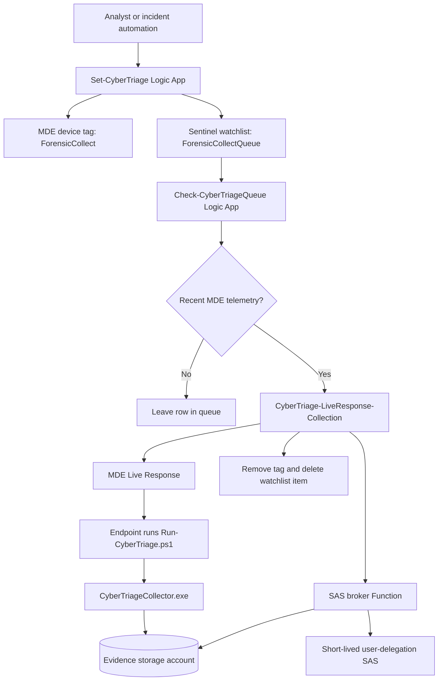

# CyberTriage Live Response Deployment

This repository packages a Microsoft Sentinel and Microsoft Defender for Endpoint workflow that launches Cyber Triage collection through MDE Live Response and uploads the encrypted result to Azure Blob Storage with a short-lived user-delegation SAS URL.

The goal is simple:

1. An analyst marks a device for collection.
2. The device is placed in a Sentinel watchlist queue.
3. A queue checker waits until the device is active in MDE.
4. A collection playbook generates a short-lived SAS URL.
5. MDE Live Response runs the Cyber Triage wrapper on the endpoint.
6. The endpoint uploads the encrypted artifact directly to Blob Storage.

No storage account key is passed to the endpoint. Shared key access should stay disabled.

## Current Status

This repo is a packaging and documentation starter. It contains validated commercial templates copied from the working lab deployment and draft GCCH copies that still need endpoint hardening before customer use.

Validated in lab on May 8, 2026:

- `Set-CyberTriage` added the MDE tag and queue row.
- `Check-CyberTriageQueue` selected only active/recent devices.
- `CyberTriage-LiveResponse-Collection` generated SAS successfully.
- MDE Live Response ran successfully on `<active-test-device>`.
- Tag removal and watchlist cleanup worked.
- Email notification failed but did not block collection.

Important lesson from the lab:

- A VM can be running in Azure and still be inactive in MDE.
- Inactive MDE devices cannot be collected because MDE Live Response cannot reliably run commands on them.

## Repository Map

```text
CyberTriage/
  .deployment
  README.md
  deploy/
    commercial/
      cybertriage-full-deployment.json
      full.sample.parameters.json
      sas-broker-function.json
      cybertriage-live-response-collection.json
      check-cybertriage-queue.json
      set-cybertriage.json
    gcch/
      *.gcch-draft.json
      README.md
  docs/
    admin-permission-handoff.md
    architecture.md
    commercial-vs-gcch.md
    deployment-step-by-step.md
    operations-runbook.md
    permissions.md
    setting-permissions-step-by-step.md
    storage-and-sas-notes.md
  src/
    LiveResponse/
      Run-CyberTriage.ps1
    SasBrokerNode/
      Generate-CyberTriageSas/
      Health/
      host.json
      package.json
  assets/
    diagrams/
      architecture.mmd
      permissions.mmd
    watchlists/
      ForensicCollectQueue.csv
  packages/
    .gitkeep
```

## What You Need Before Deployment

You need these pieces before the flow can work:

1. A Microsoft Sentinel workspace.
2. Microsoft Defender for Endpoint with devices onboarded.
3. Permission to create Logic Apps, API connections, a Function App, and Storage Accounts.
4. A permission admin who can grant managed identity permissions, if the deployment operator cannot assign Azure RBAC roles.
5. The Cyber Triage collector binary from the vendor.
6. The `Run-CyberTriage.ps1` wrapper uploaded to the MDE Live Response Library.
7. A storage account and container for encrypted Cyber Triage artifacts.
8. A SAS broker Function that can create user-delegation SAS URLs.
9. The three Logic Apps in this repo.

Permissions are split into three documents:

- [docs/permissions.md](docs/permissions.md) explains the human roles, managed identities, and per-Logic-App permissions.
- [docs/setting-permissions-step-by-step.md](docs/setting-permissions-step-by-step.md) shows exactly how to set the permissions in the Azure portal or with Azure CLI.
- [docs/admin-permission-handoff.md](docs/admin-permission-handoff.md) gives the exact handoff script for an Owner, User Access Administrator, Global Administrator, Cloud Application Administrator, or other admin who must grant permissions after deployment.

## High-Level Flow



## Deployment Order

Deploy in this order:

1. Create evidence storage.
2. Create the `cybertriage-results` container.
3. Keep `allowSharedKeyAccess=false`.
4. Deploy the SAS broker Function.
5. Give the broker managed identity storage roles.
6. Test `/api/health` on the broker.
7. Test SAS generation without printing the SAS URL.
8. Upload `CyberTriageCollector.exe` to the MDE Live Response Library.
9. Upload `Run-CyberTriage.ps1` to the MDE Live Response Library.
10. Deploy `CyberTriage-LiveResponse-Collection`.
11. Deploy `Set-CyberTriage`.
12. Deploy `Check-CyberTriageQueue` disabled first.
13. Create or verify the `ForensicCollectQueue` watchlist.
14. Set managed identity and connector permissions with [docs/setting-permissions-step-by-step.md](docs/setting-permissions-step-by-step.md). If the deployer cannot do this, use [scripts/Grant-CyberTriagePermissions.ps1](scripts/Grant-CyberTriagePermissions.ps1) as the admin handoff.
15. Run one controlled test against an active MDE device.
16. Enable the queue checker recurrence.

See [docs/deployment-step-by-step.md](docs/deployment-step-by-step.md) for the long version.

## Commercial And GCCH

Commercial Azure and GCCH are not just different regions. They can use different portals, authorities, service URLs, managed APIs, and application endpoints.

- Commercial starter templates are in [deploy/commercial](deploy/commercial).
- GCCH draft templates are in [deploy/gcch](deploy/gcch).
- Endpoint differences are tracked in [docs/commercial-vs-gcch.md](docs/commercial-vs-gcch.md).

The GCCH templates are intentionally marked as draft until the endpoint values and connector behavior are verified in a GCCH tenant.

## Deploy To Azure

Use the full deployment button first. It deploys the SAS broker Function App and all three Logic Apps into the resource group you choose.

[](https://portal.azure.com/#create/Microsoft.Template/uri/https%3A%2F%2Fraw.githubusercontent.com%2FCyberlorians%2FCyberTriage%2Fmain%2Fdeploy%2Fcommercial%2Fcybertriage-full-deployment.json)

If Azure shows a quota error like `Dynamic VMs: 0`, pick a region where the subscription has Azure Functions Consumption quota or ask the Azure subscription owner to raise the quota. That is an Azure quota problem, not a CyberTriage template problem.

The full deployment creates these names:

```text
SAS broker Function App: the name you enter during deployment
Collection Logic App: CyberTriage-LiveResponse-Collection
Incident tagging Logic App: Set-CyberTriage
Queue checker Logic App: Check-CyberTriageQueue
Watchlist name to create: ForensicCollectQueue
```

After the button finishes, do the steps below. Do not skip them. The Azure resources can exist and still fail until these permissions and connections are set.

### Set Permissions After Deployment Of The SAS Broker Function App

The SAS broker Function App is the Function App name you entered during deployment.

1. Open the Azure portal.
2. Go to the SAS broker Function App.
3. In the left menu, open `Settings` > `Identity`.
4. Make sure `System assigned` is `On`.
5. Copy the `Object (principal) ID`.
6. Go to the evidence storage account where CyberTriage results will be uploaded.
7. Open `Access control (IAM)`.
8. Select `Add` > `Add role assignment`.
9. Add `Storage Blob Delegator` to the SAS broker Function App managed identity.
10. Add `Storage Blob Data Contributor` to the SAS broker Function App managed identity.
11. Go to the Function host storage account from the deployment.
12. Open `Access control (IAM)`.
13. Add these roles to the same SAS broker Function App managed identity:

```text
Storage Blob Data Contributor
Storage Queue Data Contributor
Storage Table Data Contributor
```

### Set Permissions After Deployment Of `CyberTriage-LiveResponse-Collection`

This is the collection Logic App. It starts MDE Live Response and cleans up the queue row.

1. Open the Azure portal.
2. Go to `Logic Apps`.
3. Open `CyberTriage-LiveResponse-Collection`.
4. In the left menu, open `Settings` > `Identity`.
5. Make sure `System assigned` is `On`.
6. Copy the `Object (principal) ID`.
7. Go to the Sentinel workspace's Log Analytics workspace resource.
8. Open `Access control (IAM)`.
9. Select `Add` > `Add role assignment`.
10. Add `Microsoft Sentinel Contributor` to the `CyberTriage-LiveResponse-Collection` managed identity.

### Set Permissions After Deployment Of `Set-CyberTriage`

This is the incident tagging Logic App. It tags the MDE device and writes a row to the watchlist queue.

1. Open the Azure portal.
2. Go to `Logic Apps`.
3. Open `Set-CyberTriage`.
4. In the left menu, open `Settings` > `Identity`.
5. Make sure `System assigned` is `On`.
6. Copy the `Object (principal) ID`.
7. Go to the Sentinel workspace's Log Analytics workspace resource.
8. Open `Access control (IAM)`.
9. Select `Add` > `Add role assignment`.
10. Add `Microsoft Sentinel Contributor` to the `Set-CyberTriage` managed identity.

### Set Permissions After Deployment Of `Check-CyberTriageQueue`

This is the queue checker Logic App. It checks the watchlist and only sends active MDE devices to collection.

1. Open the Azure portal.
2. Go to `Logic Apps`.
3. Open `Check-CyberTriageQueue`.
4. In the left menu, open `Settings` > `Identity`.
5. Make sure `System assigned` is `On`.
6. Copy the `Object (principal) ID`.
7. Go to the Sentinel workspace's Log Analytics workspace resource.
8. Open `Access control (IAM)`.
9. Select `Add` > `Add role assignment`.
10. Add `Log Analytics Reader` to the `Check-CyberTriageQueue` managed identity.
11. Add `Microsoft Sentinel Contributor` to the `Check-CyberTriageQueue` managed identity.

### Copy And Paste Permission Script For The Azure Admin

If the deployer cannot add those role assignments, give this command to the person who has `Owner` or `User Access Administrator` on the target resources:

```powershell
.\scripts\Grant-CyberTriagePermissions.ps1 `
  -SubscriptionId '<subscription-guid>' `
  -PlaybookResourceGroup '<playbook-resource-group>' `
  -SentinelResourceGroup '<sentinel-resource-group>' `
  -SentinelWorkspaceName '<sentinel-workspace-name>' `
  -EvidenceStorageResourceGroup '<evidence-storage-resource-group>' `
  -EvidenceStorageAccountName '<evidence-storage-account>' `
  -FunctionHostStorageResourceGroup '<playbook-resource-group>' `
  -FunctionHostStorageAccountName '<function-host-storage-account-from-deployment>' `
  -SasBrokerFunctionAppName '<sas-broker-function-app-name-from-deployment>'
```

The Azure admin role is usually:

```text
Owner
```

or:

```text
User Access Administrator
```

Global Administrator or Application Administrator is only needed if the customer uses raw HTTP managed identity calls to MDE and wants to grant MDE application roles.

### Authorize API Connections

Azure RBAC permissions and API connection sign-in are different. Do both.

Open the Azure portal and go to the API connection resources created by the deployment. Authorize anything that shows not connected.

Important connections:

```text
wdatp-Set-CyberTriage
wdatp-CyberTriage-LiveResponse-Collection-cards
azuresentinel-Set-CyberTriage
azuresentinel-CyberTriage-LiveResponse-Collection
azuresentinel-Check-CyberTriageQueue
azuremonitorlogs-Check-CyberTriageQueue
office365-CyberTriage-LiveResponse-Collection
```

Use `office365-CyberTriage-LiveResponse-Collection` only if you want email notifications. If you do not want email, leave the connection alone or remove the email action from the Logic App.

### Create The Watchlist

Create a Microsoft Sentinel watchlist with this exact alias:

```text
ForensicCollectQueue
```

Use this CSV template:

[assets/watchlists/ForensicCollectQueue.csv](assets/watchlists/ForensicCollectQueue.csv)

When Sentinel asks for the search key, choose:

```text
MdatpDeviceId
```

The queue checker expects the watchlist alias and column names to match this template.

For the longer setup guide, see [docs/setting-permissions-step-by-step.md](docs/setting-permissions-step-by-step.md).

## Individual Commercial Buttons

Use these only if you do not want the full deployment button.

These buttons deploy the commercial Azure ARM templates from the `main` branch of `Cyberlorians/CyberTriage`.

Deploy the collection playbook first:

[](https://portal.azure.com/#create/Microsoft.Template/uri/https%3A%2F%2Fraw.githubusercontent.com%2FCyberlorians%2FCyberTriage%2Fmain%2Fdeploy%2Fcommercial%2Fcybertriage-live-response-collection.json)

Set permissions after deployment of `CyberTriage-LiveResponse-Collection`:

```text
CyberTriage-LiveResponse-Collection managed identity:
  Microsoft Sentinel Contributor on the Sentinel workspace

Connector authorization:
  WDATP connection must be authorized for MDE Live Response and tag removal
  Office 365 connection is optional for email notification
```

Then deploy the incident tagging playbook:

[](https://portal.azure.com/#create/Microsoft.Template/uri/https%3A%2F%2Fraw.githubusercontent.com%2FCyberlorians%2FCyberTriage%2Fmain%2Fdeploy%2Fcommercial%2Fset-cybertriage.json)

Set permissions after deployment of `Set-CyberTriage`:

```text
Set-CyberTriage managed identity:
  Microsoft Sentinel Contributor on the Sentinel workspace

Connector authorization:
  WDATP connection must be authorized for MDE machine tagging
  Sentinel connection must be authorized for incident and watchlist actions
```

Then deploy the queue checker:

[](https://portal.azure.com/#create/Microsoft.Template/uri/https%3A%2F%2Fraw.githubusercontent.com%2FCyberlorians%2FCyberTriage%2Fmain%2Fdeploy%2Fcommercial%2Fcheck-cybertriage-queue.json)

Set permissions after deployment of `Check-CyberTriageQueue`:

```text
Check-CyberTriageQueue managed identity:
  Log Analytics Reader on the Sentinel workspace
  Microsoft Sentinel Contributor on the Sentinel workspace

Connector authorization:
  Azure Monitor Logs connection must be authorized for Watchlist and DeviceInfo queries
  Sentinel connection must be authorized for watchlist cleanup
```

After all three buttons and the SAS broker are deployed, give this copy/paste command to the Azure permission admin:

```powershell
.\scripts\Grant-CyberTriagePermissions.ps1 `
  -SubscriptionId '<subscription-guid>' `
  -PlaybookResourceGroup '<playbook-resource-group>' `
  -SentinelResourceGroup '<sentinel-resource-group>' `
  -SentinelWorkspaceName '<sentinel-workspace-name>' `
  -EvidenceStorageResourceGroup '<storage-resource-group>' `
  -EvidenceStorageAccountName '<evidence-storage-account>' `
  -FunctionHostStorageResourceGroup '<function-host-storage-resource-group>' `
  -FunctionHostStorageAccountName '<function-host-storage-account>' `
  -SasBrokerFunctionAppName '<sas-broker-function-app>'
```

Who runs that command:

```text
Azure RBAC roles: Owner or User Access Administrator at the target scopes
Optional MDE app-role grants: Global Administrator, Privileged Role Administrator, Cloud Application Administrator, or Application Administrator
```

Use the optional MDE app-role grant only for raw HTTP managed identity designs:

```powershell
.\scripts\Grant-CyberTriagePermissions.ps1 <same parameters> -GrantDefenderAppRoles
```

For the longer version, see [docs/setting-permissions-step-by-step.md](docs/setting-permissions-step-by-step.md).

GCCH deployment buttons are documented in [deploy/gcch](deploy/gcch) as draft links until the Azure Government endpoints are verified.

## Safety Rules

Do not commit these items:

- SAS URLs.
- Function keys.
- Broker shared secrets.
- Storage account keys.
- Cyber Triage collector binaries, unless the customer explicitly owns redistribution rights and the repository is private.
- Real customer incident data.

## How To Know It Worked

A healthy run looks like this:

```text
Check-CyberTriageQueue: Succeeded
CyberTriage-LiveResponse-Collection: Succeeded
Generate_CyberTriage_Sas: Succeeded
Run_LR_Collection: Succeeded
MDE machine action: LiveResponse Succeeded
MDE Live Response commands: Completed
Remove_Tag: Succeeded
Delete_Watchlist_Item: Succeeded
```

A real artifact looks like this:

```text
cttout_<device>_<timestamp>.json.gz.enc.01
cttout_<device>_<timestamp>.json.gz.enc.02
```

`cttest-blob` is only test/probe noise. It is not the Cyber Triage artifact.

## Next Build Items

- Convert duplicated ARM values into a single environment parameter model.
- Add one-click Deploy to Azure Government buttons after GCCH endpoint verification.
- Add screenshots or rendered diagrams for the final customer guide.
- Add production screenshots for setting permissions and authorizing API connections.
