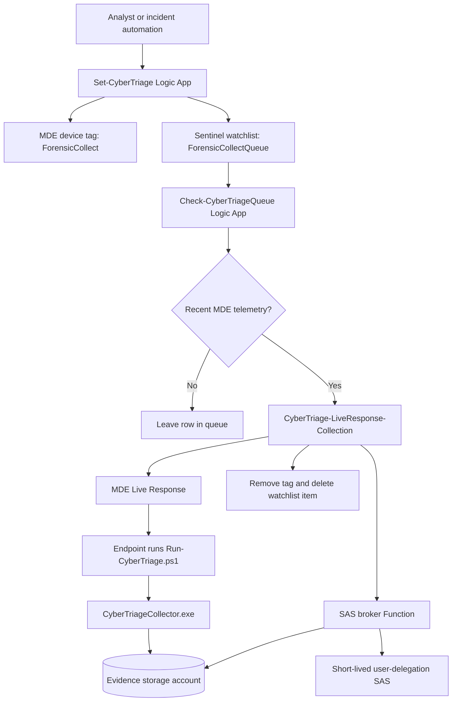

# CyberTriage Live Response Deployment

This repository packages a Microsoft Sentinel and Microsoft Defender for Endpoint workflow that launches Cyber Triage collection through MDE Live Response and uploads the encrypted result to Azure Blob Storage with a short-lived user-delegation SAS URL.

The goal is simple:

1. An analyst marks a device for collection.
2. The device is placed in a Sentinel watchlist queue.
3. A queue checker waits until the device is active in MDE.
4. A collection playbook generates a short-lived SAS URL.
5. MDE Live Response runs the Cyber Triage wrapper on the endpoint.
6. The endpoint uploads the encrypted artifact directly to Blob Storage.

No storage account key is passed to the endpoint. Shared key access should stay disabled.

## Current Status

This repo is a packaging and documentation starter. It contains validated commercial templates copied from the working lab deployment and draft GCCH copies that still need endpoint hardening before customer use.

Validated in lab on May 8, 2026:

- `Set-CyberTriage` added the MDE tag and queue row.
- `Check-CyberTriageQueue` selected only active/recent devices.
- `CyberTriage-LiveResponse-Collection` generated SAS successfully.
- MDE Live Response ran successfully on `<active-test-device>`.
- Tag removal and watchlist cleanup worked.
- Email notification failed but did not block collection.

Important lesson from the lab:

- A VM can be running in Azure and still be inactive in MDE.
- Inactive MDE devices cannot be collected because MDE Live Response cannot reliably run commands on them.

## Repository Map

```text
CyberTriage/
  .deployment
  README.md
  deploy/
    commercial/
      cybertriage-full-deployment.json
      full.sample.parameters.json
      sas-broker-function.json
      cybertriage-live-response-collection.json
      check-cybertriage-queue.json
      set-cybertriage.json
    gcch/
      *.gcch-draft.json
      README.md
  docs/
    admin-permission-handoff.md
    architecture.md
    commercial-vs-gcch.md
    deployment-step-by-step.md
    operations-runbook.md
    permissions.md
    setting-permissions-step-by-step.md
    storage-and-sas-notes.md
  src/
    LiveResponse/
      Run-CyberTriage.ps1
    SasBrokerNode/
      Generate-CyberTriageSas/
      Health/
      host.json
      package.json
  assets/
    diagrams/
      architecture.mmd
      permissions.mmd
    watchlists/
      ForensicCollectQueue.csv
  packages/
    .gitkeep
```

## What You Need Before Deployment

You need these pieces before the flow can work:

1. A Microsoft Sentinel workspace.
2. Microsoft Defender for Endpoint with devices onboarded.
3. An account that is `Owner` on the Azure subscription for the easiest full deployment. This lets the ARM template create resources and assign managed identity permissions automatically.
4. A permission admin who can grant managed identity permissions if the deployment operator is not allowed to use `Owner`.
5. The Cyber Triage collector binary from the vendor.
6. The `Run-CyberTriage.ps1` wrapper uploaded to the MDE Live Response Library.
7. A storage account and container for encrypted Cyber Triage artifacts. The full deployment can create this for you.
8. A SAS broker Function that can create user-delegation SAS URLs. The full deployment creates this for you.
9. The three Logic Apps in this repo. The full deployment creates these for you.

Permissions are split into three documents:

- [docs/permissions.md](docs/permissions.md) explains the human roles, managed identities, and per-Logic-App permissions.
- [docs/setting-permissions-step-by-step.md](docs/setting-permissions-step-by-step.md) shows exactly how to set the permissions in the Azure portal or with Azure CLI.
- [docs/admin-permission-handoff.md](docs/admin-permission-handoff.md) gives the exact handoff script for an Owner, User Access Administrator, Global Administrator, Cloud Application Administrator, or other admin who must grant permissions after deployment.

## High-Level Flow



## Deployment Order

Deploy in this order:

1. Run the full commercial deployment as `Owner` on the subscription.
2. Let ARM create evidence storage, the `cybertriage-results` container, the SAS broker Function, and the three Logic Apps.
3. Let ARM assign Azure RBAC roles to the managed identities.
4. Authorize the Logic App API connections.
5. Upload `CyberTriageCollector.exe` to the MDE Live Response Library.
6. Upload `Run-CyberTriage.ps1` to the MDE Live Response Library.
7. Create or verify the `ForensicCollectQueue` watchlist.
8. Test `/api/health` on the broker.
9. Test SAS generation without printing the SAS URL.
10. Run one controlled test against an active MDE device.
11. Enable the queue checker recurrence.

See [docs/deployment-step-by-step.md](docs/deployment-step-by-step.md) for the long version.

## Commercial And GCCH

Commercial Azure and GCCH are not just different regions. They can use different portals, authorities, service URLs, managed APIs, and application endpoints.

- Commercial starter templates are in [deploy/commercial](deploy/commercial).
- GCCH draft templates are in [deploy/gcch](deploy/gcch).
- Endpoint differences are tracked in [docs/commercial-vs-gcch.md](docs/commercial-vs-gcch.md).

The GCCH templates are intentionally marked as draft until the endpoint values and connector behavior are verified in a GCCH tenant.

## Deploy To Azure

Use the full deployment button first. It deploys the SAS broker Function App and all three Logic Apps into the resource group you choose.

[](https://portal.azure.com/#create/Microsoft.Template/uri/https%3A%2F%2Fraw.githubusercontent.com%2FCyberlorians%2FCyberTriage%2Fmain%2Fdeploy%2Fcommercial%2Fcybertriage-full-deployment.json)

Use an account that is `Owner` on the subscription for this deployment. The template creates the managed identities and assigns their Azure RBAC roles automatically.

The full ARM template can set Azure RBAC. It cannot, by itself, grant Microsoft Defender for Endpoint application roles on the WindowsDefenderATP Enterprise App. Set those MDE app roles after deployment with [scripts/Grant-CyberTriagePermissions.ps1](scripts/Grant-CyberTriagePermissions.ps1), or have an Entra admin grant them manually.

The template asks for the Sentinel workspace subscription, resource group, workspace name, and workspace customer ID. It uses those values to run a nested RBAC deployment named `Deploy-Sentinel-Rbac` at the Sentinel workspace resource group, then assigns the Logic App managed identities permissions on that workspace.

If Azure shows a quota error like `Dynamic VMs: 0`, pick a region where the subscription has Azure Functions Consumption quota or ask the Azure subscription owner to raise the quota. That is an Azure quota problem, not a CyberTriage template problem.

Testing status: the component deployment pieces and SAS flow have been validated, but the full one-button ARM deployment has not completed in this lab subscription yet because Azure validation stops on the Functions Consumption quota error above.

The full deployment creates these names:

```text
SAS broker Function App: the name you enter during deployment
Collection Logic App: CyberTriage-LiveResponse-Collection
Incident tagging Logic App: Set-CyberTriage
Queue checker Logic App: Check-CyberTriageQueue
Evidence storage account: the name you enter, or the generated default
Evidence container: cybertriage-results
Watchlist name you create after deployment: ForensicCollectQueue
```

The full deployment creates the evidence storage account and this blob container:

```text
cybertriage-results
```

The full deployment sets these Azure RBAC permissions for you:

```text
SAS broker Function App, evidence storage:
  Storage Blob Delegator on the evidence storage account
  Storage Blob Data Contributor on the evidence storage account

SAS broker Function App, Function host storage:
  These roles are for the Azure Functions runtime storage account.
  They are not for the Sentinel watchlist queue.
  Storage Blob Data Contributor on the Function host storage account
  Storage Queue Data Contributor on the Function host storage account
  Storage Table Data Contributor on the Function host storage account

CyberTriage-LiveResponse-Collection:
  Microsoft Sentinel Contributor on the Sentinel workspace

Set-CyberTriage:
  Microsoft Sentinel Contributor on the Sentinel workspace

Check-CyberTriageQueue:
  Log Analytics Reader on the Sentinel workspace
  Microsoft Sentinel Contributor on the Sentinel workspace
```

The MDE app roles still need to be granted after deployment:

```text
Set-CyberTriage managed identity:
  Machine.ReadWrite.All on the WindowsDefenderATP Enterprise App

CyberTriage-LiveResponse-Collection managed identity:
  Machine.Read.All on the WindowsDefenderATP Enterprise App
  Machine.ReadWrite.All on the WindowsDefenderATP Enterprise App
  Machine.LiveResponse on the WindowsDefenderATP Enterprise App

Check-CyberTriageQueue managed identity:
  No MDE app roles. It does not call MDE directly.
```

Permission breakdown by identity:

| Identity | What It Touches | Permission Needed | How It Is Set |
|---|---|---|---|
| SAS broker Function App managed identity | Evidence storage account and `cybertriage-results` container | Storage Blob Delegator; Storage Blob Data Contributor | Full ARM template, permission script, or manual Azure RBAC |
| SAS broker Function App managed identity | Function host storage account | Storage Blob Data Contributor; Storage Queue Data Contributor; Storage Table Data Contributor | SAS broker ARM template, permission script, or manual Azure RBAC |
| Set-CyberTriage managed identity | Sentinel workspace/watchlist | Microsoft Sentinel Contributor | Full ARM template, permission script, or manual Azure RBAC |
| Set-CyberTriage managed identity | MDE API | Machine.ReadWrite.All | Permission script or manual Entra app-role assignment |
| Check-CyberTriageQueue managed identity | Log Analytics workspace | Log Analytics Reader | Full ARM template, permission script, or manual Azure RBAC |
| Check-CyberTriageQueue managed identity | Sentinel watchlist cleanup | Microsoft Sentinel Contributor | Full ARM template, permission script, or manual Azure RBAC |
| CyberTriage-LiveResponse-Collection managed identity | Sentinel watchlist update/delete | Microsoft Sentinel Contributor | Full ARM template, permission script, or manual Azure RBAC |
| CyberTriage-LiveResponse-Collection managed identity | MDE API | Machine.Read.All; Machine.ReadWrite.All; Machine.LiveResponse | Permission script or manual Entra app-role assignment |
| CyberTriage-LiveResponse-Collection workflow | SAS broker URL | Broker shared secret in workflow parameter | Full ARM template parameter |
| CyberTriage-LiveResponse-Collection workflow | Office 365 email | Optional Office 365 connector authorization | Manual only, and only if email notification is wanted |

After the button finishes, do the steps below. Do not skip them. ARM can assign Azure RBAC roles, but the MDE app-role grants live in Entra ID and are handled by the script or by an Entra admin.

### Copy And Paste Permission Script For The Azure Admin

If the customer will not let the deployer use `Owner`, deploy the resources first, then give this command to the person who has `Owner` or `User Access Administrator` on the target resources:

```powershell
.\scripts\Grant-CyberTriagePermissions.ps1 `
  -SubscriptionId '<subscription-guid>' `
  -PlaybookResourceGroup '<playbook-resource-group>' `
  -SentinelResourceGroup '<sentinel-resource-group>' `
  -SentinelWorkspaceName '<sentinel-workspace-name>' `
  -EvidenceStorageResourceGroup '<evidence-storage-resource-group>' `
  -EvidenceStorageAccountName '<evidence-storage-account>' `
  -FunctionHostStorageResourceGroup '<playbook-resource-group>' `
  -FunctionHostStorageAccountName '<function-host-storage-account-from-deployment>' `
  -SasBrokerFunctionAppName '<sas-broker-function-app-name-from-deployment>'
```

That script sets these Azure RBAC permissions:

```text
SAS broker Function App managed identity, evidence storage:
  Storage Blob Delegator on the evidence storage account
  Storage Blob Data Contributor on the evidence storage account

SAS broker Function App managed identity, Function host storage:
  These roles are for the Azure Functions runtime storage account.
  They are not for the Sentinel watchlist queue.
  Storage Blob Data Contributor on the Function host storage account
  Storage Queue Data Contributor on the Function host storage account
  Storage Table Data Contributor on the Function host storage account

CyberTriage-LiveResponse-Collection managed identity:
  Microsoft Sentinel Contributor on the Sentinel workspace

Set-CyberTriage managed identity:
  Microsoft Sentinel Contributor on the Sentinel workspace

Check-CyberTriageQueue managed identity:
  Log Analytics Reader on the Sentinel workspace
  Microsoft Sentinel Contributor on the Sentinel workspace
```

The script also grants these MDE application roles unless you add `-SkipDefenderAppRoles`:

```text
Set-CyberTriage managed identity:
  Machine.ReadWrite.All

CyberTriage-LiveResponse-Collection managed identity:
  Machine.Read.All
  Machine.ReadWrite.All
  Machine.LiveResponse

Check-CyberTriageQueue managed identity:
  No MDE app roles
```

The script does not make the admin an `Owner`. The admin already needs enough permission to create these role assignments.

The Azure admin role is usually:

```text
Owner
```

or:

```text
User Access Administrator
```

Global Administrator, Privileged Role Administrator, Cloud Application Administrator, or Application Administrator is needed for the MDE application-role grants. If the Azure RBAC admin does not have that Entra permission, run the script with `-SkipDefenderAppRoles` and have an Entra admin grant the MDE app roles manually after deployment.

### Authorize API Connections

Azure RBAC permissions, MDE app roles, and API connection sign-in are different. Check each one.

MDE is not authorized with a WDATP connector in the commercial templates. The MDE calls use raw HTTP with the Logic App managed identity and this token audience:

```text
https://securitycenter.onmicrosoft.com/windowsatpservice
```

If MDE actions fail with `403`, check the MDE app roles above.

Open the Azure portal and go to the API connection resources created by the deployment. Authorize anything that shows not connected.

Important connections:

```text
azuresentinel-Set-CyberTriage
azuresentinel-CyberTriage-LiveResponse-Collection
azuresentinel-Check-CyberTriageQueue
azuremonitorlogs-Check-CyberTriageQueue
office365-CyberTriage-LiveResponse-Collection
```

Use `office365-CyberTriage-LiveResponse-Collection` only if you want email notifications. If you do not want email, leave the connection alone or remove the email action from the Logic App.

### Create The Watchlist

Create a Microsoft Sentinel watchlist with this exact alias:

```text
ForensicCollectQueue
```

Use this CSV template:

[assets/watchlists/ForensicCollectQueue.csv](assets/watchlists/ForensicCollectQueue.csv)

When Sentinel asks for the search key, choose:

```text
MdatpDeviceId
```

The queue checker expects the watchlist alias and column names to match this template.

For the longer setup guide, see [docs/setting-permissions-step-by-step.md](docs/setting-permissions-step-by-step.md).

## Individual Commercial Buttons

Use these only if you do not want the full deployment button.

These buttons deploy the commercial Azure ARM templates from the `main` branch of `Cyberlorians/CyberTriage`.

Deploy the collection playbook first:

[](https://portal.azure.com/#create/Microsoft.Template/uri/https%3A%2F%2Fraw.githubusercontent.com%2FCyberlorians%2FCyberTriage%2Fmain%2Fdeploy%2Fcommercial%2Fcybertriage-live-response-collection.json)

Set permissions after deployment of `CyberTriage-LiveResponse-Collection`:

```text
CyberTriage-LiveResponse-Collection managed identity:
  Microsoft Sentinel Contributor on the Sentinel workspace
  Machine.Read.All on the WindowsDefenderATP Enterprise App
  Machine.ReadWrite.All on the WindowsDefenderATP Enterprise App
  Machine.LiveResponse on the WindowsDefenderATP Enterprise App

Connector authorization:
  Office 365 connection is optional for email notification
```

Then deploy the incident tagging playbook:

[](https://portal.azure.com/#create/Microsoft.Template/uri/https%3A%2F%2Fraw.githubusercontent.com%2FCyberlorians%2FCyberTriage%2Fmain%2Fdeploy%2Fcommercial%2Fset-cybertriage.json)

Set permissions after deployment of `Set-CyberTriage`:

```text
Set-CyberTriage managed identity:
  Microsoft Sentinel Contributor on the Sentinel workspace
  Machine.ReadWrite.All on the WindowsDefenderATP Enterprise App

Connector authorization:
  Sentinel connection must be authorized for incident and watchlist actions
```

Then deploy the queue checker:

[](https://portal.azure.com/#create/Microsoft.Template/uri/https%3A%2F%2Fraw.githubusercontent.com%2FCyberlorians%2FCyberTriage%2Fmain%2Fdeploy%2Fcommercial%2Fcheck-cybertriage-queue.json)

Set permissions after deployment of `Check-CyberTriageQueue`:

```text
Check-CyberTriageQueue managed identity:
  Log Analytics Reader on the Sentinel workspace
  Microsoft Sentinel Contributor on the Sentinel workspace

Connector authorization:
  Azure Monitor Logs connection must be authorized for Watchlist and DeviceInfo queries
  Sentinel connection must be authorized for watchlist cleanup
```

After all three buttons and the SAS broker are deployed, give this copy/paste command to the Azure permission admin:

```powershell
.\scripts\Grant-CyberTriagePermissions.ps1 `
  -SubscriptionId '<subscription-guid>' `
  -PlaybookResourceGroup '<playbook-resource-group>' `
  -SentinelResourceGroup '<sentinel-resource-group>' `
  -SentinelWorkspaceName '<sentinel-workspace-name>' `
  -EvidenceStorageResourceGroup '<storage-resource-group>' `
  -EvidenceStorageAccountName '<evidence-storage-account>' `
  -FunctionHostStorageResourceGroup '<function-host-storage-resource-group>' `
  -FunctionHostStorageAccountName '<function-host-storage-account>' `
  -SasBrokerFunctionAppName '<sas-broker-function-app>'
```

Who runs that command:

```text
Azure RBAC roles: Owner or User Access Administrator at the target scopes
MDE app-role grants: Global Administrator, Privileged Role Administrator, Cloud Application Administrator, or Application Administrator
```

If one person cannot do both Azure RBAC and Entra app-role assignment, split the work:

```powershell
.\scripts\Grant-CyberTriagePermissions.ps1 <same parameters> -SkipDefenderAppRoles
```

Then have the Entra admin grant the MDE app roles listed above to `Set-CyberTriage` and `CyberTriage-LiveResponse-Collection`.

For the longer version, see [docs/setting-permissions-step-by-step.md](docs/setting-permissions-step-by-step.md).

GCCH deployment buttons are documented in [deploy/gcch](deploy/gcch) as draft links until the Azure Government endpoints are verified.

## Safety Rules

Do not commit these items:

- SAS URLs.
- Function keys.
- Broker shared secrets.
- Storage account keys.
- Cyber Triage collector binaries, unless the customer explicitly owns redistribution rights and the repository is private.
- Real customer incident data.

## How To Know It Worked

A healthy run looks like this:

```text
Check-CyberTriageQueue: Succeeded
CyberTriage-LiveResponse-Collection: Succeeded
Generate_CyberTriage_Sas: Succeeded
Run_LR_Collection: Succeeded
MDE machine action: LiveResponse Succeeded
MDE Live Response commands: Completed
Remove_Tag: Succeeded
Delete_Watchlist_Item: Succeeded
```

A real artifact looks like this:

```text
cttout_<device>_<timestamp>.json.gz.enc.01
cttout_<device>_<timestamp>.json.gz.enc.02
```

`cttest-blob` is only test/probe noise. It is not the Cyber Triage artifact.

## Next Build Items

- Convert duplicated ARM values into a single environment parameter model.
- Add one-click Deploy to Azure Government buttons after GCCH endpoint verification.
- Add screenshots or rendered diagrams for the final customer guide.
- Add production screenshots for setting permissions and authorizing API connections.
