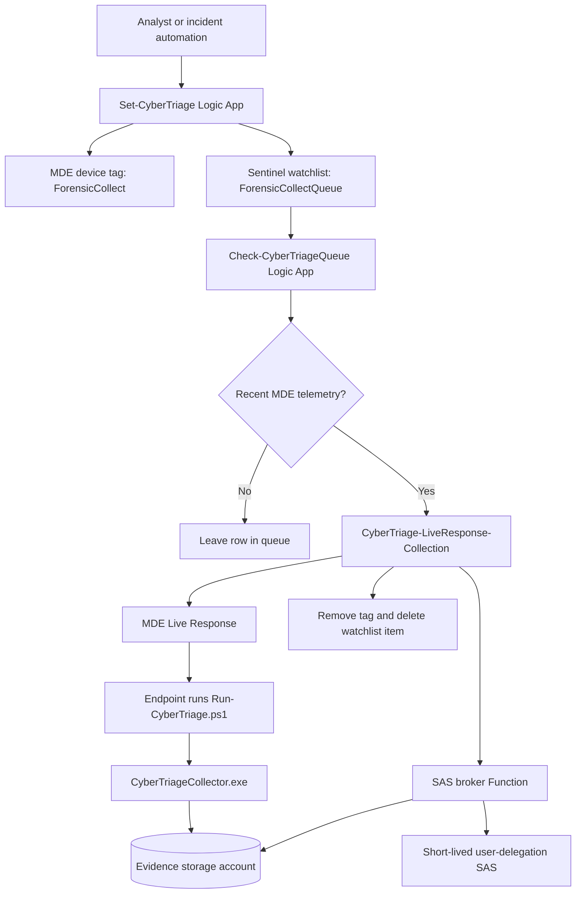

# CyberTriage Live Response Deployment

This repository packages a Microsoft Sentinel and Microsoft Defender for Endpoint workflow that launches Cyber Triage collection through MDE Live Response and uploads the encrypted result to Azure Blob Storage with a short-lived user-delegation SAS URL.

The goal is simple:

1. An analyst marks a device for collection.
2. The device is placed in a Sentinel watchlist queue.
3. A queue checker waits until the device is active in MDE.
4. A collection playbook generates a short-lived SAS URL.
5. MDE Live Response runs the Cyber Triage wrapper on the endpoint.
6. The endpoint uploads the encrypted artifact directly to Blob Storage.

No storage account key is passed to the endpoint. Shared key access should stay disabled.

## Current Status

This repo packages the commercial deployment and Azure Government / GCCH deployment wrappers. The commercial templates contain the shared workflow definitions; the GCCH templates pass Azure Government endpoint defaults into those shared templates.

Validated in lab on May 8, 2026:

- `Set-CyberTriage` added the MDE tag and queue row.
- `Check-CyberTriageQueue` selected only active/recent devices.
- `CyberTriage-LiveResponse-Collection` generated SAS successfully.
- MDE Live Response ran successfully on `<active-test-device>`.
- Tag removal and watchlist cleanup worked.
- Email notification failed but did not block collection.

Important lesson from the lab:

- A VM can be running in Azure and still be inactive in MDE.
- Inactive MDE devices cannot be collected because MDE Live Response cannot reliably run commands on them.

## Repository Map

```text
CyberTriage/
  .deployment
  README.md
  deploy/
    README.md
    commercial/
      cybertriage-full-deployment.json
      full.sample.parameters.json
      sas-broker-function.json
      cybertriage-live-response-collection.json
      check-cybertriage-queue.json
      set-cybertriage.json
      README.md
    gcch/
      cybertriage-full-deployment.json
      sas-broker-function.json
      cybertriage-live-response-collection.json
      check-cybertriage-queue.json
      set-cybertriage.json
      full.sample.parameters.json
      README.md
  docs/
    admin-permission-handoff.md
    architecture.md
    commercial-vs-gcch.md
    deployment-step-by-step.md
    operations-runbook.md
    permissions.md
    setting-permissions-step-by-step.md
    storage-and-sas-notes.md
  src/
    LiveResponse/
      Run-CyberTriage.ps1
    SasBrokerNode/
      Generate-CyberTriageSas/
      Health/
      host.json
      package.json
  assets/
    diagrams/
      architecture.mmd
      permissions.mmd
    watchlists/
      ForensicCollectQueue.csv
  packages/
    SasBrokerNode.zip
    .gitkeep
```

## What You Need Before Deployment

You need these pieces before the flow can work:

1. A Microsoft Sentinel workspace.
2. Microsoft Defender for Endpoint with devices onboarded.
3. An account that is `Owner` on the Azure subscription for the easiest full deployment. This lets the ARM template create resources and assign managed identity permissions automatically.
4. A permission admin who can grant managed identity permissions if the deployment operator is not allowed to use `Owner`.
5. The Cyber Triage collector binary from the vendor.
6. The `Run-CyberTriage.ps1` wrapper uploaded to the MDE Live Response Library.
7. A storage account and container for encrypted Cyber Triage artifacts. The full deployment can create this for you.
8. A SAS broker Function that can create user-delegation SAS URLs. The full deployment creates this for you.
9. The three Logic Apps in this repo. The full deployment creates these for you.

Permissions are split into three documents:

- [docs/permissions.md](docs/permissions.md) explains the human roles, managed identities, and per-Logic-App permissions.
- [docs/setting-permissions-step-by-step.md](docs/setting-permissions-step-by-step.md) shows exactly how to set the permissions in the Azure portal or with Azure CLI.
- [docs/admin-permission-handoff.md](docs/admin-permission-handoff.md) gives the exact handoff script for an Owner, User Access Administrator, Global Administrator, Cloud Application Administrator, or other admin who must grant permissions after deployment.

## High-Level Flow



## Deployment Order

Deploy in this order:

1. Run the full commercial deployment as `Owner` on the subscription.
2. Let ARM create evidence storage, the `cybertriage-results` container, the SAS broker Function, and the three Logic Apps.
3. Let ARM assign Azure RBAC roles to the managed identities.
4. Authorize the Logic App API connections.
5. Upload `CyberTriageCollector.exe` to the MDE Live Response Library.
6. Upload `Run-CyberTriage.ps1` to the MDE Live Response Library.
7. Create or verify the `ForensicCollectQueue` watchlist.
8. Test `/api/health` on the broker.
9. Test SAS generation without printing the SAS URL.
10. Run one controlled test against an active MDE device.
11. Enable the queue checker recurrence.

See [docs/deployment-step-by-step.md](docs/deployment-step-by-step.md) for the long version.

## Commercial And GCCH

Commercial Azure and GCCH are not just different regions. They use different
portals, authorities, service URLs, managed APIs, and application endpoints.

The deployment guide is unified for both clouds. Pick your cloud, click the
matching deploy button, then follow the same step-by-step instructions:

[deploy/README.md](deploy/README.md)

Endpoint differences are also tracked in
[docs/commercial-vs-gcch.md](docs/commercial-vs-gcch.md).

GCCH verification performed on May 9, 2026 confirmed the Azure Government cloud
endpoints, required managed API connectors in `usgovvirginia`, and the
WindowsDefenderATP enterprise app with the required MDE app roles. End-to-end
Live Response still requires an onboarded, active MDE device in the target
tenant.

## Deploy

Pick your cloud and use the matching button. Both buttons deploy the same
underlying templates and create the same resource set. Cloud-specific defaults
(MDE API, ARM, storage suffix) are pre-filled per cloud.

| Commercial Azure | Azure Government / GCC High |
|---|---|
| Portal: `https://portal.azure.com` | Portal: `https://portal.azure.us` |
| [](https://portal.azure.com/#create/Microsoft.Template/uri/https%3A%2F%2Fraw.githubusercontent.com%2FCyberlorians%2FCyberTriage%2Fmain%2Fdeploy%2Fcommercial%2Fcybertriage-full-deployment.json) | [](https://portal.azure.us/#create/Microsoft.Template/uri/https%3A%2F%2Fraw.githubusercontent.com%2FCyberlorians%2FCyberTriage%2Fmain%2Fdeploy%2Fgcch%2Fcybertriage-full-deployment.json) |

After clicking, follow the field-by-field instructions in
[deploy/README.md](deploy/README.md). The unified guide shows what to enter in
every ARM form field, side by side for Commercial and GCCH where the values
differ.

The `Broker Shared Secret` field can be left blank. ARM auto-generates the
value with `newGuid()` and wires it into both the Function app setting and the
Logic App URL in the same deployment, so they always match.

If you redeploy later and leave the field blank, ARM regenerates a new value.
Both sides get refreshed in the same deployment, so they stay in sync. To keep
the same secret across redeploys, paste the existing value into the field on
the redeploy.

The full ARM template can set Azure RBAC if the deployer has rights to do so.
It cannot, by itself, grant Microsoft Defender for Endpoint application roles
on the WindowsDefenderATP Enterprise App. Set those MDE app roles after
deployment with [scripts/Grant-CyberTriagePermissions.ps1](scripts/Grant-CyberTriagePermissions.ps1),
or have an Entra admin grant them manually.

If Azure shows a quota error like `Dynamic VMs: 0`, pick a region where the
subscription has Azure Functions Consumption quota or ask the subscription
owner to raise the quota. That is an Azure quota problem, not a CyberTriage
template problem.

## Safety Rules

Do not commit these items:

- SAS URLs.
- Function keys.
- Broker shared secrets.
- Storage account keys.
- Cyber Triage collector binaries, unless the customer explicitly owns redistribution rights and the repository is private.
- Real customer incident data.

## How To Know It Worked

A healthy run looks like this:

```text
Check-CyberTriageQueue: Succeeded
CyberTriage-LiveResponse-Collection: Succeeded
Generate_CyberTriage_Sas: Succeeded
Run_LR_Collection: Succeeded
MDE machine action: LiveResponse Succeeded
MDE Live Response commands: Completed
Remove_Tag: Succeeded
Delete_Watchlist_Item: Succeeded
```

A real artifact looks like this:

```text
cttout_<device>_<timestamp>.json.gz.enc.01
cttout_<device>_<timestamp>.json.gz.enc.02
```

`cttest-blob` is only test/probe noise. It is not the Cyber Triage artifact.

## Next Build Items

- Convert duplicated ARM values into a single environment parameter model.
- Add one-click Deploy to Azure Government buttons after GCCH endpoint verification.
- Add screenshots or rendered diagrams for the final customer guide.
- Add production screenshots for setting permissions and authorizing API connections.
