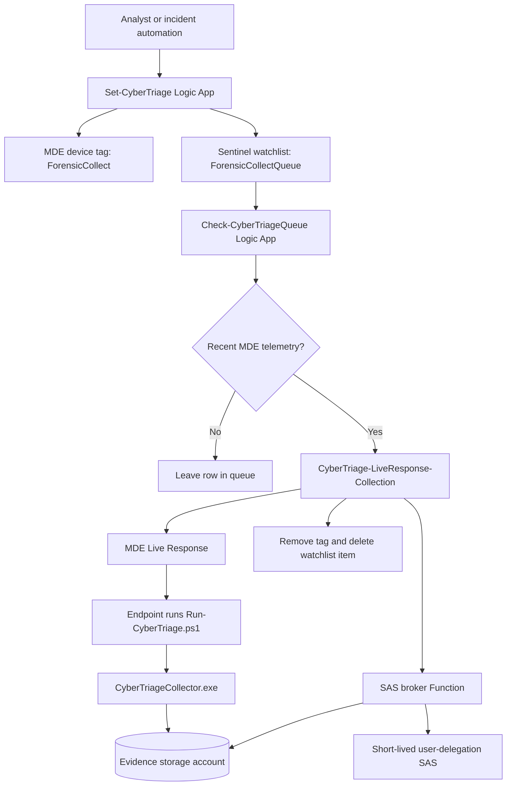

# CyberTriage Live Response

A Microsoft Sentinel + Microsoft Defender for Endpoint workflow that launches
Cyber Triage forensic collection through MDE Live Response and uploads the
encrypted artifact directly to Azure Blob Storage with a short-lived
user-delegation SAS URL.

No storage account key is sent to the endpoint. Shared key access stays
disabled.

---

## How It Works



Step by step:

1. **Tag a device.** An analyst (or an incident automation playbook) tags the
   device in Microsoft Defender for Endpoint with `ForensicCollect`. The
   analyst can also add a row directly to the `ForensicCollectQueue` Sentinel
   watchlist instead of tagging.
2. **Enqueue the device.** `Set-CyberTriage` adds a row to the
   `ForensicCollectQueue` Sentinel watchlist with the MDE device ID, the
   incident ID, and the tag name.
3. **Wait for the device.** `Check-CyberTriageQueue` runs on a recurrence and
   only picks rows whose device has reported recent telemetry to MDE. Offline
   or stale devices stay in the queue.
4. **Get a one-time SAS URL.** `CyberTriage-LiveResponse-Collection` calls the
   SAS broker Function. The broker uses its managed identity to mint a
   short-lived user-delegation SAS for the evidence container. No storage
   account key is ever issued.
5. **Run on the endpoint.** The collection workflow starts an MDE Live
   Response session that uploads `Run-CyberTriage.ps1` and
   `CyberTriageCollector.exe` from the MDE Library, then runs the wrapper.
6. **Upload directly to Blob.** The collector encrypts the artifact and
   streams it to the evidence storage account using the SAS URL. Nothing is
   staged on disk longer than needed.
7. **Clean up.** The workflow removes the MDE tag and deletes (or updates) the
   watchlist row so the same device is not collected twice.

---

## Requirements

Before you deploy, line up two roles. They are usually two different people.

### Who Deploys The ARM Template (Step 1)

| Required | Why |
|---|---|
| **`Owner`** on the target Azure subscription. | The template creates resources, assigns Azure RBAC to managed identities, and writes role assignments on the Sentinel workspace. `Contributor` is not enough — it cannot create role assignments. |
| Deploy into **the same subscription that contains your Microsoft Sentinel workspace**. | The template wires the playbook managed identities to the Sentinel workspace by name. Cross-subscription is supported but Owner is then required on both subscriptions. Same-subscription is simpler. |
| Microsoft Defender for Endpoint enabled in the same tenant, with at least one onboarded device. | The collection workflow calls the MDE API and runs Live Response. |

### Who Runs The Permission Script (Step 2)

| Required | Why |
|---|---|
| **Microsoft Entra Global Administrator** *or* **Application Administrator** *or* **Cloud Application Administrator** *or* **Privileged Role Administrator**. | The script grants Microsoft Defender for Endpoint application roles to the Logic App managed identities on the WindowsDefenderATP enterprise app. Only an Entra admin role can do that — ARM cannot. |

### Other Things You Need

```text
Cyber Triage collector binary (CyberTriageCollector.exe) from the vendor
Permission to upload files to the MDE Live Response Library
Permission to create a Sentinel watchlist in the target workspace
A test device that is onboarded to MDE and recently active
```

---

## Deployment

One guide for both clouds. Any field that differs between Commercial Azure and
Azure Government / GCC High is shown side by side.

### Step 1. Click Deploy

Pick your cloud and click the matching button. Both buttons load the same form
in the matching portal.

| Commercial Azure | Azure Government / GCC High |
|---|---|
| Portal: `https://portal.azure.com` | Portal: `https://portal.azure.us` |
| [](https://portal.azure.com/#create/Microsoft.Template/uri/https%3A%2F%2Fraw.githubusercontent.com%2FCyberlorians%2FCyberTriage%2Fmain%2Fdeploy%2Fcommercial%2Fcybertriage-full-deployment.json) | [](https://portal.azure.us/#create/Microsoft.Template/uri/https%3A%2F%2Fraw.githubusercontent.com%2FCyberlorians%2FCyberTriage%2Fmain%2Fdeploy%2Fgcch%2Fcybertriage-full-deployment.json) |

The full deployment creates these resources in the resource group you select:

```text
Evidence storage account
Evidence blob container: cybertriage-results
SAS broker Function App
Function host storage account
CyberTriage-LiveResponse-Collection Logic App
Set-CyberTriage Logic App
Check-CyberTriageQueue Logic App
Azure RBAC assignments that ARM is allowed to create
```

Form-field guidance is grouped below. Click any section to expand.

<details>
<summary><b>Subscription, Resource Group, And Region</b></summary>

| Portal Field | What To Put |
|---|---|
| Subscription | Subscription where CyberTriage resources will be created. **Use the same subscription that contains the Sentinel workspace.** |
| Resource group | New or existing resource group for CyberTriage. |
| Region | Region for the CyberTriage resources. Pick a region your subscription has Functions Consumption quota in. |
| Location | Generated value matching the region. |

</details>

<details>
<summary><b>Broker Shared Secret</b></summary>

Leave blank. The template auto-generates the secret with `newGuid()` and wires
it into both the Function app setting and the Logic App URL in the same
deployment, so they always match. To keep the same secret across redeploys,
paste the existing value into this field.

</details>

<details>
<summary><b>Function And Storage Names</b></summary>

| Portal Field | What To Put |
|---|---|
| Sas Broker Function App Name | Globally unique Function App name for the SAS broker. |
| Function Host Storage Account Name | Storage account used internally by Azure Functions. |
| Sas Broker Package Uri | Keep the default unless hosting the package yourself. |
| Destination Storage Account Name | Evidence storage account for encrypted Cyber Triage output. |
| Target Device Tag | MDE device tag used to mark devices for collection. Default: `ForensicCollect`. |

Storage account name rules: lowercase letters and numbers only, 3-24
characters, globally unique, no dashes, no underscores.

</details>

<details>
<summary><b>Notification Email (Optional)</b></summary>

Leave blank to skip email. Enter a monitored security mailbox to get a
notification when a collection is dispatched.

If used, the Office 365 connection still needs manual user authorization after
deployment (covered in Step 3).

</details>

<details>
<summary><b>Sentinel Workspace Values</b></summary>

The form takes four separate fields. It does not take a single workspace
resource ID and it does not take only the workspace GUID.

| Portal Field | Where To Find It |
|---|---|
| Sentinel Workspace Subscription Id | The subscription that contains the Sentinel workspace. Should match the deploy subscription. |
| Sentinel Workspace Resource Group | The resource group of the Log Analytics workspace that has Sentinel enabled. |
| Sentinel Workspace Name | The Log Analytics workspace name. |
| Sentinel Workspace Customer Id | Workspace ID / customer ID GUID from the workspace Overview page. |

</details>

<details>
<summary><b>Cloud-Specific Endpoint Defaults</b></summary>

Pre-filled per cloud. Do not change unless you know why.

| Portal Field | Commercial Default | GCCH Default |
|---|---|---|
| Defender Api Base Uri | `https://api.securitycenter.microsoft.com` | `https://api-gov.securitycenter.microsoft.us` |
| Defender Api Audience | `https://securitycenter.onmicrosoft.com/windowsatpservice` | `https://api-gov.securitycenter.microsoft.us` |
| Arm Base Uri | `https://management.azure.com` | `https://management.usgovcloudapi.net` |
| Arm Audience | `https://management.azure.com/` | `https://management.usgovcloudapi.net/` |
| Storage Blob Dns Suffix | `blob.core.windows.net` | `blob.core.usgovcloudapi.net` |
| Storage Token Resource | `https://storage.azure.com/` | `https://storage.azure.com/` |

For regular GCC (not GCC High), the Defender API endpoint is normally
`https://api-gcc.securitycenter.microsoft.us`.

</details>

<details>
<summary><b>Other Defaults</b></summary>

| Portal Field | Default |
|---|---|
| Watchlist Alias | `ForensicCollectQueue` |
| Sas Expiry Minutes | `1440` |
| Sas Permissions | `racwdl` |
| Poll Frequency Minutes | `60` |
| Online Window Minutes | `60` |

</details>

<details>
<summary><b>Review And Create</b></summary>

Select **Review + create**, wait for validation to pass, then select **Create**.
Wait for `Deployment status: Succeeded`. If it fails, expand the failed nested
deployment in Deployment details to see the real error.

</details>

---

### Step 2. Run The Permission Script

> **A Microsoft Entra Global Administrator or Application Administrator must
> run this step.** The script grants Microsoft Defender for Endpoint
> application roles to the Logic App managed identities. ARM cannot do this on
> its own because the roles live in Microsoft Entra ID on the
> WindowsDefenderATP enterprise application.

Download the script:
[scripts/Grant-CyberTriageDefenderRoles.ps1](scripts/Grant-CyberTriageDefenderRoles.ps1)

Run it from a PowerShell session signed in to the same tenant. No parameters
required:

```powershell
# Commercial
az login
.\Grant-CyberTriageDefenderRoles.ps1
```

```powershell
# GCC High
az cloud set --name AzureUSGovernment
az login
.\Grant-CyberTriageDefenderRoles.ps1
```

The script grants:

| Logic App Managed Identity | MDE App Roles Granted |
|---|---|
| `Set-CyberTriage` | `Machine.ReadWrite.All` |
| `CyberTriage-LiveResponse-Collection` | `Machine.Read.All`, `Machine.ReadWrite.All`, `Machine.LiveResponse` |
| `Check-CyberTriageQueue` | None (does not call MDE) |

The script is idempotent. Running it again only adds missing roles.

---

## Verification

### Step 3. Authorize Logic App API Connections

The Sentinel and Log Analytics connections use managed identity and do not
need user authorization. The Office 365 connection is the only one that
requires a user to sign in, and only if `NotificationEmail` was filled in at
deploy time.

If you set a notification email:

```text
1. Open the CyberTriage resource group.
2. Open the API connection that starts with: office365-
3. Select Edit API connection.
4. Select Authorize and sign in with a mailbox that can send mail.
5. Select Save.
```

If you left the email blank, skip this step.

### Step 4. Upload The MDE Live Response Library Files

Upload both files to the Microsoft Defender for Endpoint Live Response
Library. The names must match exactly.

```text
CyberTriageCollector.exe
Run-CyberTriage.ps1
```

The wrapper script is in this repo:
[src/LiveResponse/Run-CyberTriage.ps1](src/LiveResponse/Run-CyberTriage.ps1)

How to upload in the Microsoft Defender portal:

```text
1. Open https://security.microsoft.com  (GCCH: https://security.microsoft.us)
2. Settings -> Endpoints -> Advanced features.
3. Confirm Live Response is on for servers and clients as needed.
4. Select any onboarded device -> Initiate Live Response Session.
5. In the Live Response console, select the Library icon (top right).
6. Select Upload file to library.
7. Upload CyberTriageCollector.exe. Add a description. Select Confirm.
8. Repeat: Upload file to library -> Run-CyberTriage.ps1 -> Confirm.
9. Close the Live Response session.
```

The two files are now available to every Live Response session in the tenant.

### Step 5. Create The Sentinel Watchlist

Create the `ForensicCollectQueue` watchlist in the same Sentinel workspace you
entered during deploy. The Logic Apps read and write rows in this watchlist to
track collection state.

Starter CSV in this repo:
[assets/watchlists/ForensicCollectQueue.csv](assets/watchlists/ForensicCollectQueue.csv)

How to create it in the Sentinel portal:

```text
1. Open Microsoft Sentinel and select the workspace from deploy.
2. Configuration -> Watchlists.
3. Select + New.
4. General tab:
     Name:        ForensicCollectQueue
     Alias:       ForensicCollectQueue   (must match the deploy parameter)
     Description: CyberTriage collection queue
5. Select Next: Source.
6. Source tab:
     Source type:           Local file
     File:                  upload ForensicCollectQueue.csv from this repo
     Number of header rows: 1
     Search key:            MdatpDeviceId
7. Select Next: Review and create -> Create.
```

Important columns:

| Column | Purpose |
|---|---|
| `MdatpDeviceId` | MDE device ID. Required. Used as the watchlist search key. |
| `DeviceName` | Friendly device name. Optional. |
| `IncidentId` | Sentinel incident that triggered the queue row. Optional. |
| `TagName` | MDE tag used to dispatch this row. Defaults to the deploy tag. |
| `EnqueuedTime` | UTC timestamp the row was added. |
| `Attempts` | Dispatch attempt count. The queue checker increments it. |
| `Status` | Blank or `Pending` is treated as ready. Other values: `BlockedLiveResponse`, `Dispatched`. |
| `RetryAfterUtc` | If set, the queue checker waits until this time before retrying. |

Blank `Status` is valid and is treated as pending.

### Step 6. Test The Broker Health Endpoint

Open the `sasBrokerHealthUrl` deployment output in a browser.

| Commercial | GCCH |
|---|---|
| `https://<function-app-name>.azurewebsites.net/api/health` | `https://<function-app-name>.azurewebsites.us/api/health` |

Expected:

```json
{ "status": "ok" }
```

### Step 7. Test SAS Generation

POST to the broker URL with the broker secret. Returned `sasUrl` should start:

| Commercial | GCCH |
|---|---|
| `https://<destination-storage-account>.blob.core.windows.net/cybertriage-results?` | `https://<destination-storage-account>.blob.core.usgovcloudapi.net/cybertriage-results?` |

### Step 8. Run One Controlled Device Test

Pick one onboarded MDE device that has been recently seen and can run Live
Response.

```text
1. Add or enqueue the device for collection.
2. Run Check-CyberTriageQueue manually, or enable it temporarily.
3. Confirm CyberTriage-LiveResponse-Collection starts.
4. Confirm MDE creates a Live Response action.
5. Confirm a blob appears in cybertriage-results.
6. Confirm the MDE tag is removed.
7. Confirm the watchlist item is deleted or updated.
```

Expected blob name pattern: `cttout_<device>_<timestamp>.json.gz.enc.01`

### Step 9. Enable The Queue Checker

Only after one controlled test works:

```text
1. Open Logic Apps.
2. Open Check-CyberTriageQueue.
3. Select Overview.
4. Select Enable.
```

---

## Troubleshooting Quick Checks

### Deployment Fails At Sentinel RBAC

Check whether the deployer has permission on the Sentinel workspace
subscription and resource group.

### Broker Health Returns 404

```text
Function App exists
WEBSITE_RUN_FROM_PACKAGE points to packages/SasBrokerNode.zip
Function runtime is Node 20
Function host storage role assignments are in place
```

### MDE Calls Return 403

Re-run `Grant-CyberTriageDefenderRoles.ps1` and confirm:

```text
Set-CyberTriage:
  Machine.ReadWrite.All

CyberTriage-LiveResponse-Collection:
  Machine.Read.All
  Machine.ReadWrite.All
  Machine.LiveResponse
```

### Queue Checker Finds No Devices

The device must be active in MDE with recent `DeviceInfo` telemetry in the
Sentinel workspace. A running VM is not enough.

---

## Individual Deployment Buttons

Use only when deploying pieces separately.

| Component | Commercial | GCCH |
|---|---|---|
| SAS broker only | [](https://portal.azure.com/#create/Microsoft.Template/uri/https%3A%2F%2Fraw.githubusercontent.com%2FCyberlorians%2FCyberTriage%2Fmain%2Fdeploy%2Fcommercial%2Fsas-broker-function.json) | [](https://portal.azure.us/#create/Microsoft.Template/uri/https%3A%2F%2Fraw.githubusercontent.com%2FCyberlorians%2FCyberTriage%2Fmain%2Fdeploy%2Fgcch%2Fsas-broker-function.json) |
| Collection playbook only | [](https://portal.azure.com/#create/Microsoft.Template/uri/https%3A%2F%2Fraw.githubusercontent.com%2FCyberlorians%2FCyberTriage%2Fmain%2Fdeploy%2Fcommercial%2Fcybertriage-live-response-collection.json) | [](https://portal.azure.us/#create/Microsoft.Template/uri/https%3A%2F%2Fraw.githubusercontent.com%2FCyberlorians%2FCyberTriage%2Fmain%2Fdeploy%2Fgcch%2Fcybertriage-live-response-collection.json) |
| Incident tagging playbook only | [](https://portal.azure.com/#create/Microsoft.Template/uri/https%3A%2F%2Fraw.githubusercontent.com%2FCyberlorians%2FCyberTriage%2Fmain%2Fdeploy%2Fcommercial%2Fset-cybertriage.json) | [](https://portal.azure.us/#create/Microsoft.Template/uri/https%3A%2F%2Fraw.githubusercontent.com%2FCyberlorians%2FCyberTriage%2Fmain%2Fdeploy%2Fgcch%2Fset-cybertriage.json) |
| Queue checker only | [](https://portal.azure.com/#create/Microsoft.Template/uri/https%3A%2F%2Fraw.githubusercontent.com%2FCyberlorians%2FCyberTriage%2Fmain%2Fdeploy%2Fcommercial%2Fcheck-cybertriage-queue.json) | [](https://portal.azure.us/#create/Microsoft.Template/uri/https%3A%2F%2Fraw.githubusercontent.com%2FCyberlorians%2FCyberTriage%2Fmain%2Fdeploy%2Fgcch%2Fcheck-cybertriage-queue.json) |
