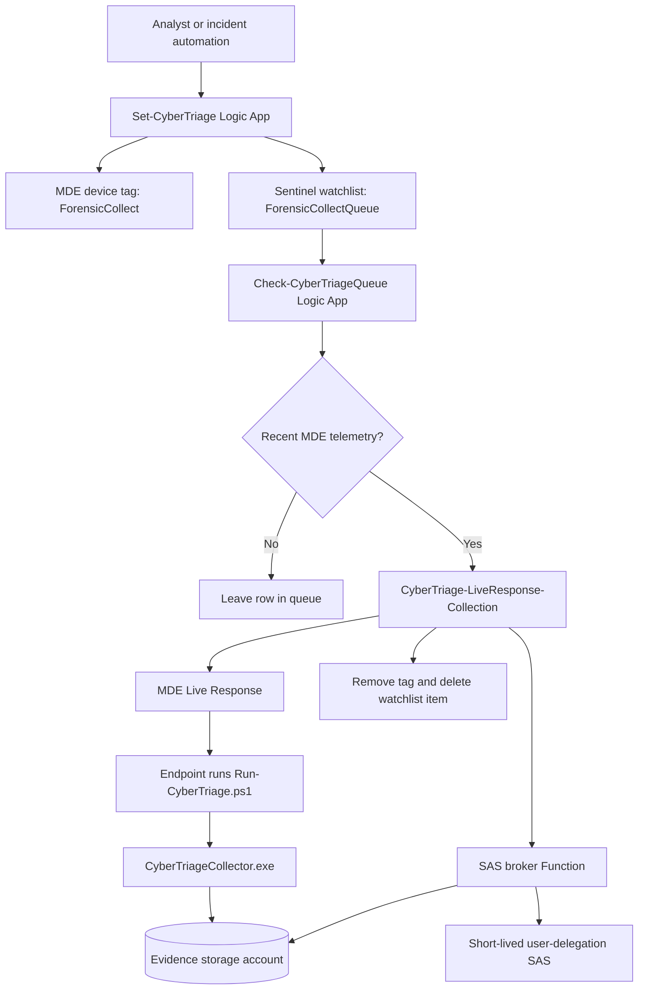

# Architecture

This page explains the pieces and how they fit together.

## The Big Idea

Cyber Triage collection is started by MDE Live Response. The endpoint runs the collector locally and uploads the encrypted output to Azure Blob Storage.

Sentinel and Logic Apps coordinate the work. MDE does the endpoint action. Storage receives the file.

## Main Components

| Component | What It Does |
|---|---|
| `Set-CyberTriage` | Tags devices in MDE and adds queue rows to a Sentinel watchlist. |
| `ForensicCollectQueue` | Sentinel watchlist that stores devices waiting for collection. |
| `Check-CyberTriageQueue` | Scheduled Logic App that checks the queue and only dispatches devices that look active in MDE telemetry. |
| `CyberTriage-LiveResponse-Collection` | Generates SAS, starts MDE Live Response, removes tags, and cleans up watchlist rows. |
| SAS broker Function | Creates short-lived user-delegation SAS URLs without using storage account keys. |
| `Run-CyberTriage.ps1` | MDE Live Response wrapper that launches the Cyber Triage collector on the endpoint. |
| `CyberTriageCollector.exe` | Vendor collector binary. Not included in this repo. |
| Evidence storage account | Blob storage account where encrypted Cyber Triage output lands. |

## Flow Diagram



## Step By Step Flow

### 1. Analyst chooses a device

The analyst starts from an incident or from a known device.

The device must be onboarded to Microsoft Defender for Endpoint.

### 2. `Set-CyberTriage` marks the device

`Set-CyberTriage` does two things:

1. Adds the MDE device tag `ForensicCollect`.
2. Adds a row to the `ForensicCollectQueue` watchlist.

The watchlist row should include:

```text
MdatpDeviceId
DeviceName
IncidentId
TagName
EnqueuedTime
Attempts
Status
RetryAfterUtc
```

`Status` can be blank. Blank means pending.

### 3. Queue checker waits for an active endpoint

`Check-CyberTriageQueue` runs on a schedule.

It reads watchlist rows through the ARM Watchlist REST API with its managed identity.

Queued rows are handed to `CyberTriage-LiveResponse-Collection`, which checks MDE Live Response state before dispatch.

This is intentional. MDE Live Response cannot reliably run on inactive endpoints.

### 4. Collection playbook starts

When the queue checker finds an eligible active device, it calls `CyberTriage-LiveResponse-Collection`.

That playbook checks for existing active Live Response actions first. If a device already has a pending or in-progress LR action, the playbook should avoid starting another one.

### 5. SAS broker creates temporary upload access

The collection playbook asks the SAS broker for a SAS URL.

The SAS broker uses managed identity and Azure Storage user delegation SAS.

The SAS URL is passed to the Live Response wrapper.

### 6. MDE Live Response runs commands

The collection playbook asks MDE Live Response to run two commands:

```text
PutFile CyberTriageCollector.exe
RunScript Run-CyberTriage.ps1 -AzureSasUrl '<runtime SAS>' -Profile <fast|full>
```

The wrapper starts the collector in the background. Live Response does not wait for the full collection to finish.

### 7. Endpoint uploads the artifact

The collector uploads encrypted output to the storage container.

Real Cyber Triage files look like:

```text
cttout_<device>_<timestamp>.json.gz.enc.01
cttout_<device>_<timestamp>.json.gz.enc.02
```

### 8. Cleanup happens after Live Response handoff

After the Live Response request is accepted, the playbook removes the MDE tag and deletes the watchlist item.

That means the queue row can disappear before the final blob appears. The row disappearing means LR handoff succeeded. It does not always mean the full collector upload has finished yet.

## Why Inactive Devices Stay Queued

An Azure VM can be powered on but still inactive in MDE.

The queue checker cares about MDE, not just Azure power state.

The important chain is:

```text
MDE Active -> Live Response can run -> collector can start -> blob can upload
```

If MDE says `Inactive`, the flow should wait.

## Validated Healthy Run

A healthy run observed on May 8, 2026 had:

```text
Generate_CyberTriage_Sas = Succeeded
Run_LR_Collection = Succeeded
MDE machine action = LiveResponse Succeeded
Both MDE commands = Completed
Remove_Tag = Succeeded
Delete_Watchlist_Item = Succeeded
```

The only failed action was the email notification. That did not block the collection handoff.
