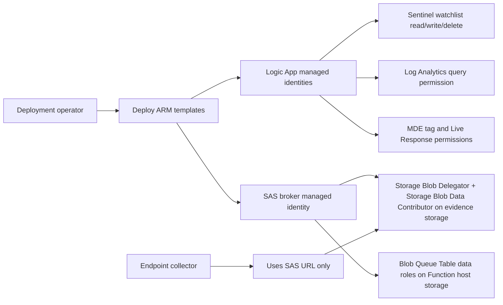

# Permissions

This page lists the permissions needed by people and managed identities.

The exact names can vary by tenant and cloud. Treat this as the starting checklist.

## Deployment Operator

The person deploying the solution needs enough permission to create resources and assign roles.

Recommended during build or pilot:

```text
Owner
```

If Owner is not allowed, the operator usually needs a combination like:

```text
Contributor
User Access Administrator
Logic App Contributor
API Connection Contributor
Function App Contributor
Storage Account Contributor
Microsoft Sentinel Contributor
Log Analytics Contributor or Reader
```

The key point: role assignments are required. A plain Contributor cannot always grant those.

## SAS Broker Managed Identity

The SAS broker is the Function that creates user-delegation SAS URLs.

On the evidence storage account, grant:

```text
Storage Blob Delegator
Storage Blob Data Contributor
```

Why:

- `Storage Blob Delegator` lets the broker request a user delegation key.
- `Storage Blob Data Contributor` lets the broker work with the container/blob data plane.

On the Function host storage account, the lab used:

```text
Storage Blob Data Contributor
Storage Blob Data Owner
Storage Queue Data Contributor
Storage Table Data Contributor
Storage Account Contributor
```

This was used because the Function host storage used managed identity settings instead of an account key connection string.

## Collection Logic App Managed Identity

`CyberTriage-LiveResponse-Collection` needs to:

- Call the SAS broker.
- Start MDE Live Response through the WDATP connector.
- Remove the MDE tag through the WDATP connector.
- Update or delete watchlist items.
- Send optional email notification.

The current commercial template uses API connections for MDE, Sentinel, Office 365, and Azure Blob.

For actions that use raw HTTP with managed identity, grant the workflow identity permission to the relevant resource.

Recommended workspace-level role:

```text
Microsoft Sentinel Contributor
```

If using raw MDE HTTP with managed identity instead of the connector, the workflow identity must receive Defender for Endpoint application roles on the WindowsDefenderATP service principal.

Commercial Defender service principal details from lab notes:

```text
WindowsDefenderATP appId: fc780465-2017-40d4-a0c5-307022471b92
Machine.Read.All role id: ea8291d3-4b9a-44b5-bc3a-6cea3026dc79
Machine.ReadWrite.All role id: aa027352-232b-4ed4-b963-a705fc4d6d2c
Commercial token audience: https://securitycenter.onmicrosoft.com/windowsatpservice
Commercial API URL: https://api.securitycenter.microsoft.com
```

Important gotcha:

The token audience is not always the same as the API URL. In commercial MDE, using the API URL as the managed identity audience caused an empty `roles` claim and 403 errors.

## Queue Checker Logic App Managed Identity

`Check-CyberTriageQueue` needs to:

- Query Log Analytics / Sentinel tables.
- Read current watchlist rows.
- Delete duplicate watchlist items.
- Call the collection playbook trigger URL.

Recommended roles:

```text
Log Analytics Reader on the workspace
Microsoft Sentinel Contributor on the workspace
```

The collection trigger URL is a secret URL. Store it as a secure parameter. Do not print it in docs or logs.

## Set-CyberTriage Logic App Identity And Connections

`Set-CyberTriage` needs to:

- Read incident host entities.
- Add an MDE tag to the host.
- Add a watchlist item.

The commercial template uses Sentinel and WDATP API connections. Those connections may require authorization after deployment.

Recommended workspace role:

```text
Microsoft Sentinel Contributor
```

MDE permissions must allow tagging devices.

## Endpoint Requirements

The endpoint must be:

```text
Onboarded to MDE
Active in MDE
Able to run MDE Live Response
Able to reach Azure Blob Storage over HTTPS
```

Azure VM power state is not enough. A VM can be running in Azure but inactive in MDE.

## Permissions Diagram



## What To Verify After Deployment

Check these items before running the first real collection:

```text
SAS broker health returns 200 OK
Broker can create a SAS without printing it
Evidence storage shared key access is disabled
Function host storage is reachable by the Function
Logic App connections are authorized
MDE Live Response library has both files
Target endpoint is Active in MDE
Target endpoint has ForensicCollect tag
Watchlist row exists
Queue checker is enabled only after validation
```
