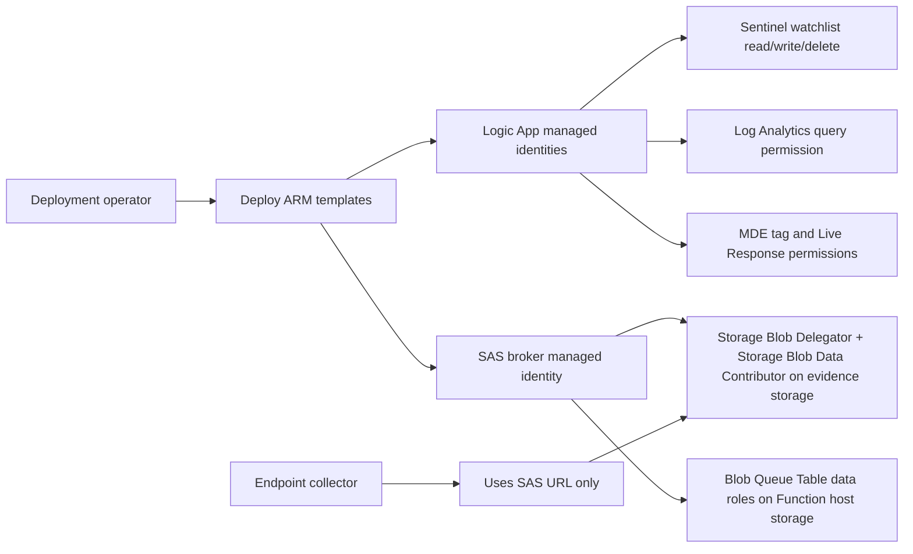

# Permissions

This page explains who needs access, what each managed identity needs, and what to do when the deployment operator is not allowed to grant permissions.

There are two different jobs:

1. Deploy the resources.
2. Grant the permissions used by those resources.

In small labs, one person may do both. In a customer tenant, these jobs are often split between a deployment engineer, an Azure subscription owner, a Sentinel admin, an MDE admin, and an Entra admin.

## The Short Answer

If one person is doing everything for a pilot, the easiest path is:

```text
Azure subscription or resource groups: Owner
Sentinel workspace: Microsoft Sentinel Contributor
MDE portal: permission to manage machine tags and Live Response library
Entra ID: permission to authorize connector consent or assign app roles if using raw HTTP managed identity
```

If that is not allowed, use the split model below.

## Split Responsibility Model

| Person | What They Do | Minimum Permission Shape |
|---|---|---|
| Deployment operator | Clicks Deploy to Azure and creates Logic Apps, connections, Function, and storage. | Contributor on the playbook resource group, plus permission to create Microsoft.Web, Microsoft.Logic, Microsoft.Storage, and Microsoft.Insights resources. |
| Azure RBAC admin | Grants managed identity Azure roles after deployment. | Owner or User Access Administrator at the storage and Sentinel workspace scopes. |
| Sentinel admin | Confirms watchlist access and Sentinel playbook behavior. | Microsoft Sentinel Contributor on the Sentinel workspace. |
| MDE admin | Uploads Live Response library files and confirms Live Response settings. | Defender role that can run Live Response, manage the Live Response library, and manage machine tags. |
| Entra admin | Grants app roles or admin consent if the design uses raw HTTP managed identity for MDE. | Global Administrator, Privileged Role Administrator, Cloud Application Administrator, or Application Administrator, depending on tenant policy. |

## Subscription Permissions For The Person Deploying

The person clicking the ARM deployment buttons needs enough Azure permission to create resources.

Recommended for a pilot:

```text
Contributor on the playbook resource group
Storage Account Contributor if storage is created separately
Logic App Contributor
Website Contributor or Function App Contributor
Log Analytics Reader on the Sentinel workspace, for validation
Microsoft Sentinel Contributor on the Sentinel workspace, for watchlist/playbook validation
```

If the customer uses a custom deployment role instead of Contributor, it must be allowed to create and update at least these resource types:

```text
Microsoft.Logic/workflows
Microsoft.Web/connections
Microsoft.Web/sites
Microsoft.Storage/storageAccounts
Microsoft.Insights/diagnosticSettings if storage or workflow diagnostics are added
```

Important: these permissions create resources, but they do not always allow the person to grant permissions to managed identities.

To assign Azure RBAC roles, the person needs:

```text
Owner
```

or:

```text
User Access Administrator
```

at the scope where the role is being assigned.

Common role assignment scopes:

```text
Evidence storage account
Function host storage account
Sentinel / Log Analytics workspace
```

## If The Deployer Cannot Grant Managed Identity Permissions

Use this handoff model:

1. The deployer creates the resources with the ARM buttons.
2. The deployer gives the Azure RBAC admin the resource names.
3. The Azure RBAC admin runs [scripts/Grant-CyberTriagePermissions.ps1](../scripts/Grant-CyberTriagePermissions.ps1).
4. The Entra admin runs the optional Defender app-role section only if the template version uses raw HTTP managed identity for MDE.
5. The MDE admin authorizes or validates MDE connector access and uploads Live Response library files.

Example command for the Azure RBAC admin:

```powershell
.\scripts\Grant-CyberTriagePermissions.ps1 `
  -SubscriptionId '<subscription-guid>' `
  -PlaybookResourceGroup '<playbook-resource-group>' `
  -SentinelResourceGroup '<sentinel-resource-group>' `
  -SentinelWorkspaceName '<sentinel-workspace-name>' `
  -EvidenceStorageResourceGroup '<storage-resource-group>' `
  -EvidenceStorageAccountName '<evidence-storage-account>' `
  -FunctionHostStorageResourceGroup '<function-host-storage-resource-group>' `
  -FunctionHostStorageAccountName '<function-host-storage-account>' `
  -SasBrokerFunctionAppName '<sas-broker-function-app>'
```

Example command when the admin wants to preview changes first:

```powershell
.\scripts\Grant-CyberTriagePermissions.ps1 <same parameters> -WhatIf
```

Example command for a raw-HTTP MDE managed identity design:

```powershell
.\scripts\Grant-CyberTriagePermissions.ps1 <same parameters> -GrantDefenderAppRoles
```

The current commercial templates use WDATP managed connectors for MDE actions. Those connectors may still require portal authorization. Azure RBAC role assignment alone does not authorize every managed connector.

The optional Defender app-role grant in the script targets `Set-CyberTriage` and `CyberTriage-LiveResponse-Collection`. The queue checker does not call MDE directly, so it does not receive MDE app roles.

## SAS Broker Function Managed Identity

The SAS broker Function creates user-delegation SAS URLs.

It needs this access on the evidence storage account:

| Role | Why It Is Needed |
|---|---|
| Storage Blob Delegator | Lets the broker request a user delegation key. Without this, user-delegation SAS generation fails. |
| Storage Blob Data Contributor | Lets the broker work with the blob/container data plane needed for the upload SAS flow. |

It also needs access to the Function host storage account. The baseline script grants:

```text
Storage Blob Data Contributor
Storage Queue Data Contributor
Storage Table Data Contributor
```

In the lab, these broader roles were also used when troubleshooting Function host storage with managed identity:

```text
Storage Blob Data Owner
Storage Account Contributor
```

Those broader roles are available in the script behind `-IncludeHostStorageOwnerRoles`. Use them only if the minimum host storage roles are not enough for the selected Function hosting model.

## Set-CyberTriage Logic App Permissions

`Set-CyberTriage` handles the analyst or incident request.

It does these jobs:

```text
Read Sentinel incident host entities
Add the ForensicCollect tag to the MDE device
Write a queue row to the ForensicCollectQueue watchlist
```

Required access:

| Area | Permission |
|---|---|
| Sentinel workspace | Microsoft Sentinel Contributor, so it can work with watchlists and incident context. |
| MDE | Permission to add machine tags. With the connector template, this is handled by the WDATP API connection authorization. With raw HTTP managed identity, grant the needed MDE application roles to the workflow identity. |

Important connector note:

The template creates API connections, but some connections still need an authorized user or managed identity configuration after deployment. If the WDATP connection is unauthorized, device tagging fails even if the Logic App exists.

## Check-CyberTriageQueue Logic App Permissions

`Check-CyberTriageQueue` is the scheduler.

It does these jobs:

```text
Query Watchlist rows
Query DeviceInfo telemetry
Deduplicate queue rows
Delete old duplicate watchlist rows
Call the collection playbook trigger URL
```

Required access:

| Area | Permission |
|---|---|
| Log Analytics workspace | Log Analytics Reader, so it can query `Watchlist` and `DeviceInfo`. |
| Sentinel workspace | Microsoft Sentinel Contributor, so it can delete duplicate watchlist items if needed. |
| Collection playbook trigger | The secure HTTP trigger URL for `CyberTriage-LiveResponse-Collection`. Store as a secure parameter. |

The queue checker intentionally leaves inactive devices in the watchlist. This is not a permission issue. It is because MDE Live Response cannot reliably run on inactive endpoints.

## CyberTriage-LiveResponse-Collection Logic App Permissions

`CyberTriage-LiveResponse-Collection` performs the actual handoff to MDE Live Response.

It does these jobs:

```text
Ask the SAS broker for a short-lived SAS URL
Check for active Live Response actions
Submit MDE Live Response commands
Remove the ForensicCollect tag after handoff
Delete the watchlist row after handoff
Optionally send email notification
```

Required access:

| Area | Permission |
|---|---|
| SAS broker | Access to the broker URL and broker secret or function key, depending on broker auth model. |
| MDE | Permission to read machine actions, run Live Response, and remove machine tags. With connector templates, this is handled by WDATP API connection authorization. With raw HTTP managed identity, grant MDE application roles. |
| Sentinel workspace | Microsoft Sentinel Contributor, so the workflow can update blocked rows and delete queue items. |
| Office 365 | Optional. Only needed for email notification. If the email action fails, the collection handoff can still succeed. |

The endpoint uploads directly to Blob Storage through SAS. The collection Logic App does not need storage account keys.

## Microsoft Defender For Endpoint App Roles

The current templates use WDATP connector actions for MDE operations. In that model, connector authorization is still important.

If the solution is changed to raw HTTP actions with managed identity, the workflow identity must receive MDE application roles on the WindowsDefenderATP service principal.

Commercial values from the lab notes:

```text
WindowsDefenderATP appId: fc780465-2017-40d4-a0c5-307022471b92
Commercial token audience: https://securitycenter.onmicrosoft.com/windowsatpservice
Commercial API URL: https://api.securitycenter.microsoft.com
```

Known roles used in previous MDE managed identity testing:

```text
Machine.Read.All
Machine.ReadWrite.All
```

The script looks up role IDs dynamically instead of hardcoding them.

Important gotcha:

The MDE token audience is not the same as the API URL. In commercial MDE testing, using the API URL as the managed identity audience produced a token without application roles and caused 403 errors.

## MDE Portal Permissions

Someone must also configure or validate MDE itself.

They need permission to:

```text
Use Live Response
Upload files to the Live Response library
Approve or allow unsigned scripts if tenant policy requires it
Manage or apply machine tags
View machine action status
```

Files that must exist in the Live Response library:

```text
CyberTriageCollector.exe
Run-CyberTriage.ps1
```

## Endpoint Requirements

The endpoint must be:

```text
Onboarded to MDE
Active in MDE
Able to run MDE Live Response
Able to reach Azure Blob Storage over HTTPS
```

Azure VM power state is not enough. A VM can be running in Azure but inactive in MDE.

## What To Verify After Permissions Are Granted

Check these items before running the first real collection:

```text
SAS broker health returns 200 OK
Broker can create a SAS without printing it
Evidence storage shared key access is disabled
Function host storage is reachable by the Function
Logic App connections are authorized
MDE Live Response library has both files
Target endpoint is Active in MDE
Target endpoint has ForensicCollect tag
Watchlist row exists
Queue checker is enabled only after validation
```

## Permissions Diagram


